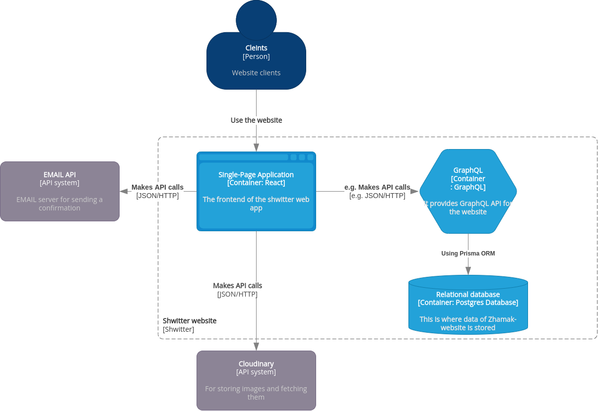
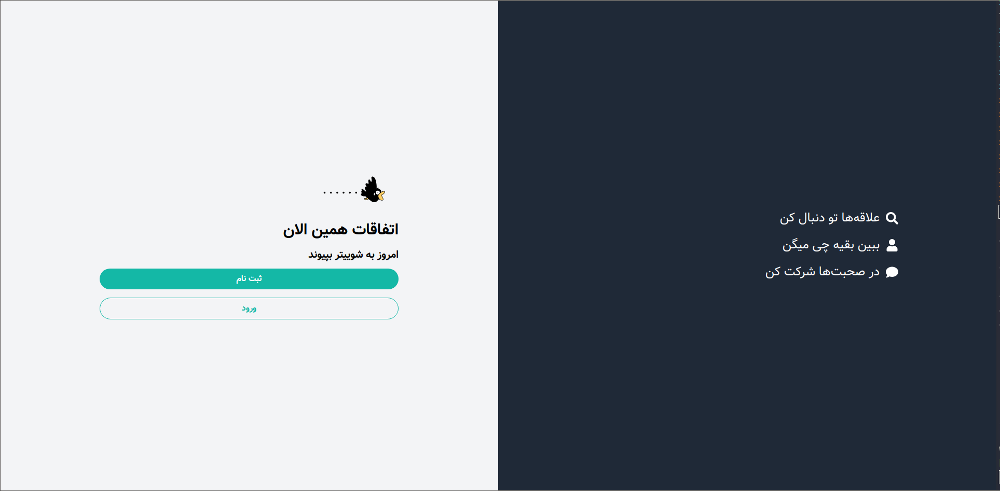

# Shwitter

Shwitter is a persian clone of twitter. This example shows how to implement a
simple micro-service architecture using modern stack. Following is the [C4](https://c4model.com/) of the software architecture:



## Tech Stack

### Backend

- [**Apollo Server**](https://github.com/apollographql/apollo-server): HTTP server for GraphQL APIs
- [**GraphQL Nexus**](https://nexusjs.org/docs/): GraphQL schema definition and resolver implementation 
- [**Prisma Client**](https://www.prisma.io/docs/concepts/components/prisma-client): Databases access (ORM)                  
- [**Prisma Migrate**](https://www.prisma.io/docs/concepts/components/prisma-migrate): Database migrations               
- [**Postgres**](https://www.sqlite.org/index.html): SQL database

### Frontend

- [**React**](https://react.io): front-end JavaScript library for building user interfaces based on UI components
- [**React-Hook-Form**](https://react-hook-form.com/): Performant, flexible and extensible forms with easy-to-use validation
- [**Yup**](https://www.npmjs.com/package/Yup): Yup is a JavaScript schema builder for value parsing and validation
- [**TailwindCss**](https://tailwindcss.com/): A utility-first CSS framework

## Contents

- [Schema](#Schema)
- [Getting Started](#getting-started)
- [Project Showcase](#project-showcase)
- [Todo](#todo)
- [References](#refrences)
- [License](#license)

## Schema
In this project, we take the schema-first approach, meaning first we create the schema by which
back-end and front-end will communicate. Here is the first draft of the schema:

```graphql
# GraphQL Schema
type LikedShweet {
  likedAt: DateTime!
  shweet: Shweet
  shweetId: Int!
  user: User
  userId: Int!
}

type Mutation {
  deleteShweet(id: Int!): Shweet!
  like(shweetId: Int!): LikedShweet
  login(email: String!, password: String!): AuthPayload!
  shweet(content: String!): Shweet!
  signup(email: String!, name: String!, password: String!): AuthPayload!
  updateShweet(content: String!, id: Int!): Shweet!
}

type Query {
  allUsers(filter: String, skip: Int, take: Int): AllUsers!
  feed(filter: String, orderBy: [ShweetOrderByInput!], skip: Int, take: Int): Feed!
  me: User
}

type Shweet {
  author: User
  content: String!
  createdAt: DateTime!
  id: Int!
  likedShweet: [LikedShweet!]!
  updatedAt: DateTime!
}

input ShweetOrderByInput {
  content: Sort
  createdAt: Sort
}

type User {
  email: String!
  id: Int!
  name: String!
  shweets: [Shweet!]!
}

type Feed {
  count: Int!
  shweets: [Shweet!]!
}

enum Sort {
  asc
  desc
}
```

## Getting started
### For development environment
#### Prerequisite
Install latest version of `Docker` and `Docker Compose` (Windows users should use WSL!)

1. First, make sure you provide .env file both for back and front
```bash
cp front/env.example front/.env
cp back/env.example back/.env
```
2. To fire up the back-end use following command:
```bash
docker compose up db back
# use docker-compose if you haven't installed docker compose plugin for docker
```
This will setup Postgresql database on port `5432` and a GraphQL server on port `4000`.
Open up this [http://localhost:4000](http://localhost:4000) to make sure everything is OK.

3. Although there is containerized version of the front as well, for smoother experience, I
suggest to run it locally. In that case, run the following commands:
```bash
# install lts version of yarn in your machine first
yarn install
yarn start
```
Now you should see the browser staring at [http://localhost:3000](http://localhost:3000)

## Project showcase


## Todo
- [x] Create CI/CD for the front and back
- [x] Signup and Login page
- [x] Adding GraphQL Schema
- [ ] User can change their profile info
- [ ] Connection to cloudinary
- [ ] Users can shwit
- [ ] Unit test for Front
- [ ] Unit test for back

## References
- [HOWTOGRAPHQL](https://www.howtographql.com/): A complete resource for setting up the GraphQL server and client 
## License
**This project is licensed under the terms of the MIT license.**
